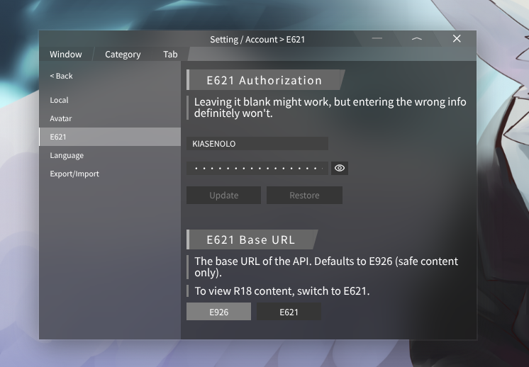
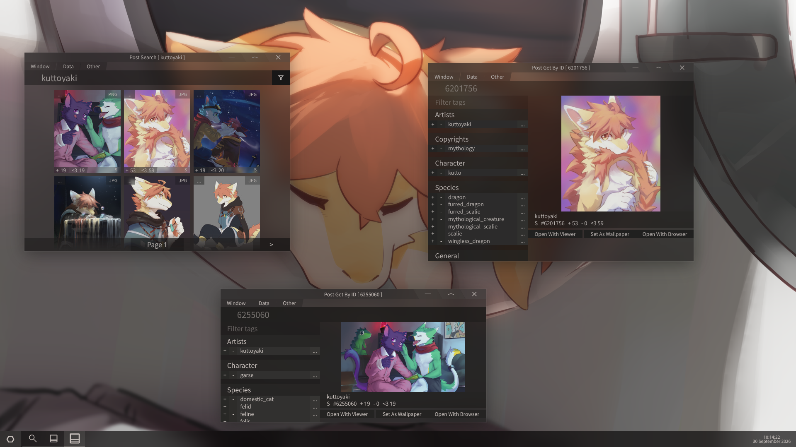
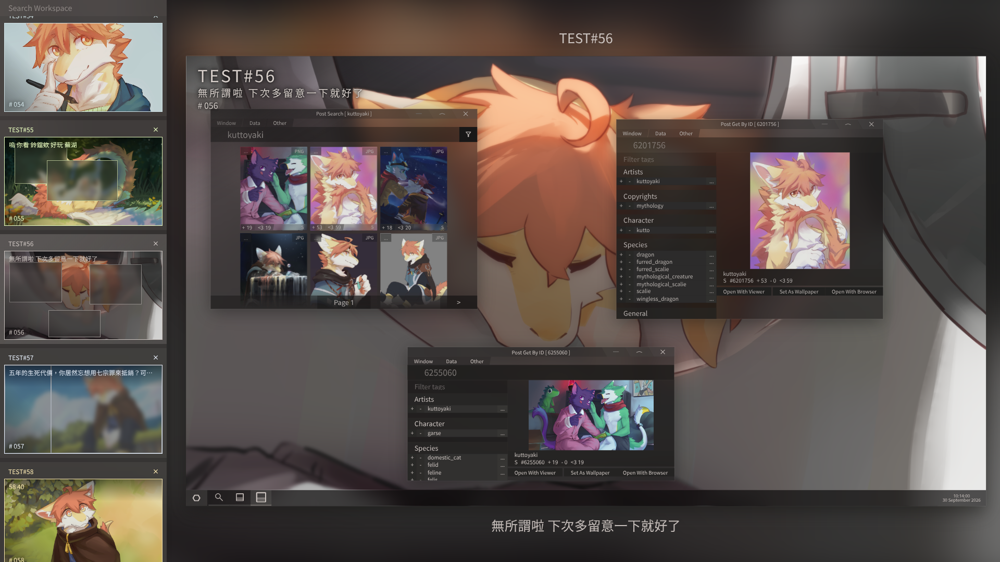
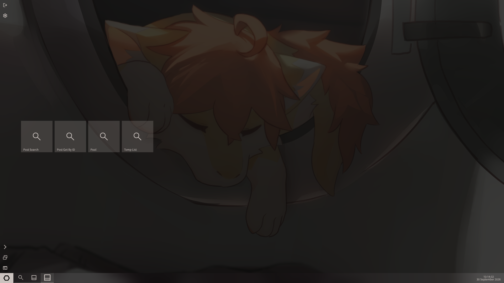
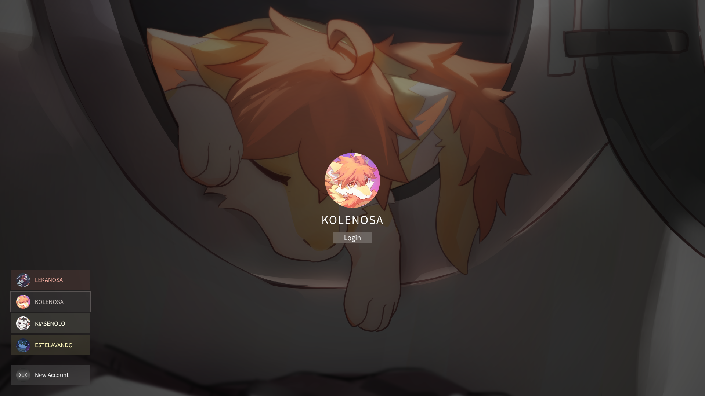
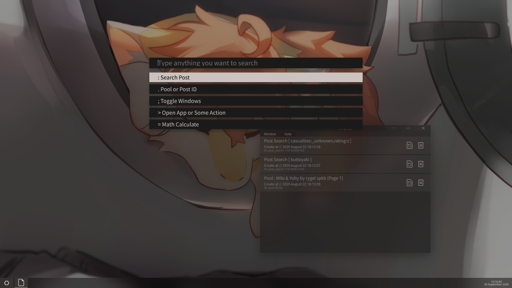

# [E621 Windowed App / inDev 0.1.1](./UPDATE.md)
# 我要先講
這東西：  
動畫很多 也很卡  
效能優化很抽象  
搜尋沒有自動選字  
甚至之後可能會不小心刪掉所有資料 或者是資料結構發生改變  
請斟酌使用 不要過度依賴  

然後這東西有很多bug  
然後有bug要講 我盡可能修  
如果 有更好的建議可以跟我講  
我不一定會采納 但一定會看  
可以丟issues 這樣我就看到了  
你也可以丟pr 但 我....可能會花很多時間去消化就是了  

預設會用E926(就 安全模式的E621)  
如果想看到一些....東西的話 請自己手動開設定 然後進賬號設定裡面改
  

***

# 概念
這個是 全視窗化的E621 App 所以跟傳統意義上的E621 App 會有很大的區別  
啊因爲是全視窗化 所以會顛覆掉很多邏輯 需要自己重新去熟悉  
但是 熟了之後應該會蠻好玩的  
然後下面是一些截圖 你可以自己看看 

  
  
  
  
  

桌布是kuttoyaki的 頭貼也是 他畫的很好看  
https://x.com/Kuttoyaki 

對了 預設是沒任何賬號的 上面的演示圖是 我作品集裏面的版本  

# 已知問題
沒有自動登錄的選項 預設都是開著的  
postSearch的按鈕只能拖 暫時不能按（emm....雖然在postGetById裏面 你真的只能拖）  
你如果沒耐心等視窗載入 然後你在這種時候 開工作區編輯器 你會直接損失您的視窗 （有種人生到頭的感覺）  
## 甚至有些東西還沒做
設定裏面很空  
沒下載隊列  

***

# 如何讓他在我電腦上面跑起來
先把專案下載下來 然後呢？ 去裝Node.js  
然後在專案根目錄 開終端 `npm i` 裝個套件    
然後 接下來 就看你 如果你想寫 或者玩一下 那就 `npm run dev`  
如果你想直接跑 那 就 `npm run build` 跑好了之後就 `npm start`  
東西會開在 http://127.0.0.1:1069/ ( 十分好Port )

# 跟各位想幫我寫的人講一下
我的專案資料結構會很奇怪  
（ 因爲這東西是從我作品集裏面拆出來的 ）
而且東西都寫在同個檔案  
所以會很痛苦  
抱歉 但 我現在暫時不想改掉這個習慣  

然後還有一些神奇東西：
首先我的 CSS 會用到一些你可能沒有在資料夾裏面看到的字體 因爲這東西是從我作品集扣過來的 所以 殘留物  
其次程式碼會有一些 AI 生成時留下的註解 我可能沒刪到 這 十分正常  
再來 我的命名方式基本上來講 就是 你要學會通靈 或者說看他用在哪裡 你才能大概知道這是幹嘛用的  
然後 程式碼的註解非常有攻擊性 但不是特別針對誰 ~~都是在針對我自己~~  
最後我程式碼寫很爛  
就這樣  

# 那些是AI生的？ （跟風 寫個這個）
## AI生的
- 工作區的邏輯大部分邏輯
- 古希臘掌管存檔的神 （class WorkSpaceActions）
- 視窗管理器的邏輯 （Window.tsx / WindowsManager.ts）
- 調用E621_API的工具 / type.d.ts （我懶）
- 調用OPFS的工具 （我真的懶）
- 其他複雜燒腦的大東西
## 你可能覺得是AI 但其實是我手刻的
- 樣式/過渡動畫/反正 所有界面設計的工作
- 全局的拖放邏輯
- 搜尋的邏輯 （有fuse.js應該...手刻....不難...吧？）
- 其他看起來簡單的小東西

***

# 小故事
當初開專案的時間是1月7號 那請問那個時候發生了什麽呢  
那個時候 我們老師在教調用API  
那 因爲我遠超他們 我就問欸老師 我用我會的可以嗎  
他説隨便你  
然後 我就想到 我之前想過我要寫視窗化的E621  
所以這東西 嚴重性從原本的 學校小東西  
直接升級成 非常嚴重的大專案  
我不知道我有什麽病 但現在看來 當初的決定一定是對的  
雖然這repo好像也沒人看就是了 但沒差啦 我還是寫的很開心  
寫這鳥東西 只爲了使用者界面 和 使用者體驗 沒了  
